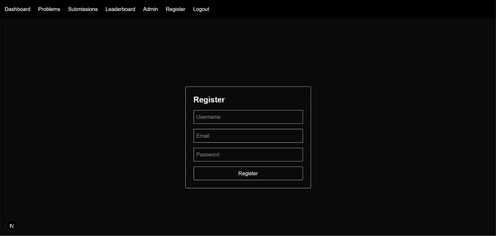
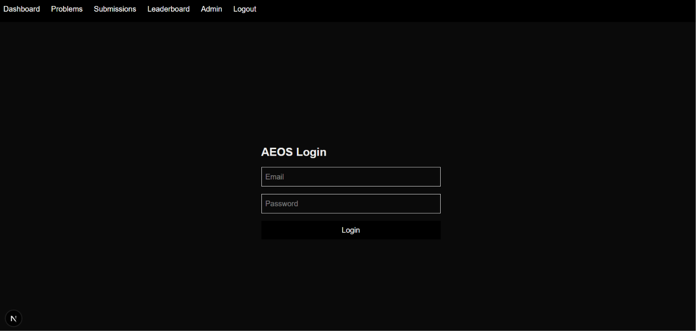
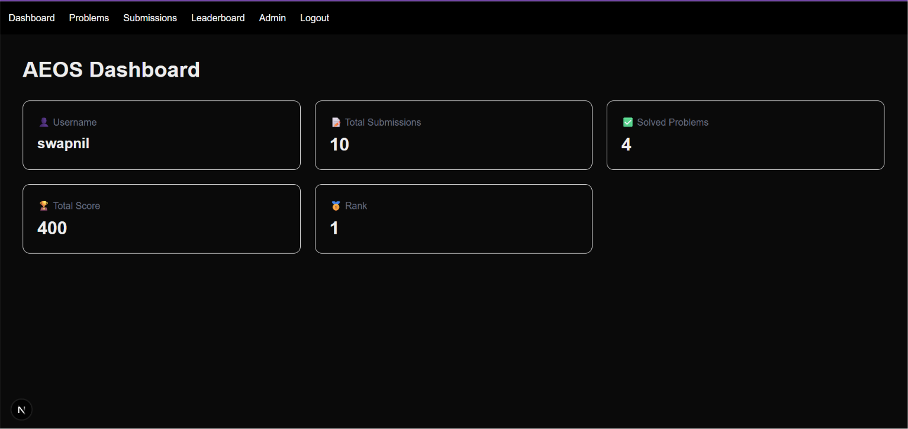
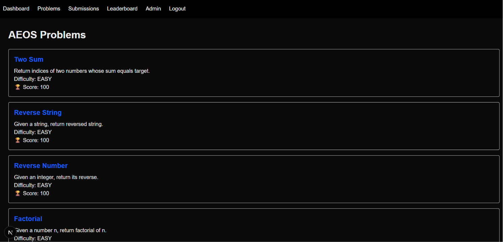
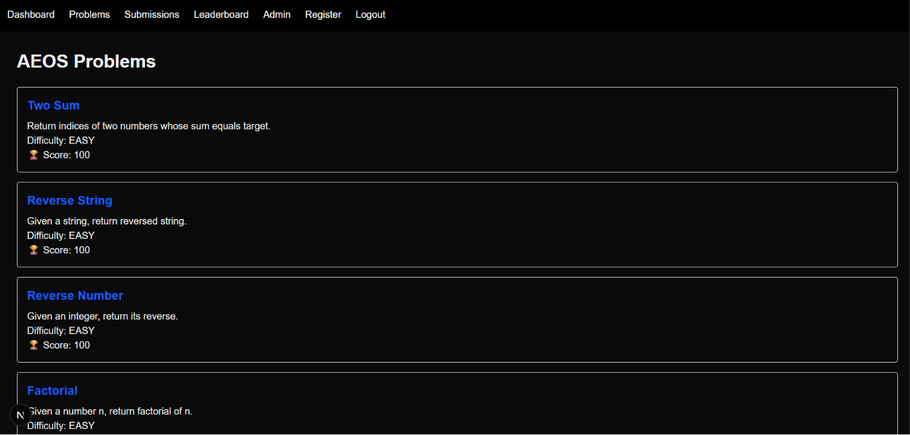
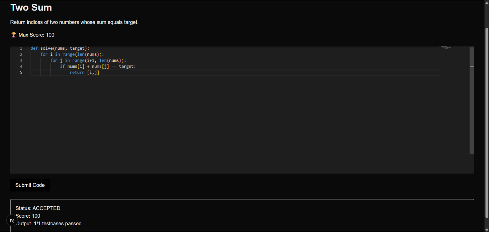
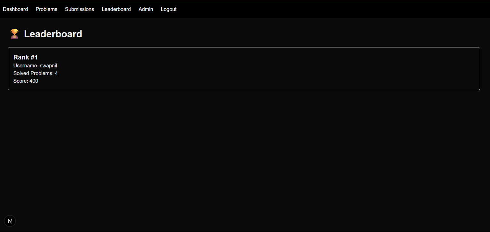
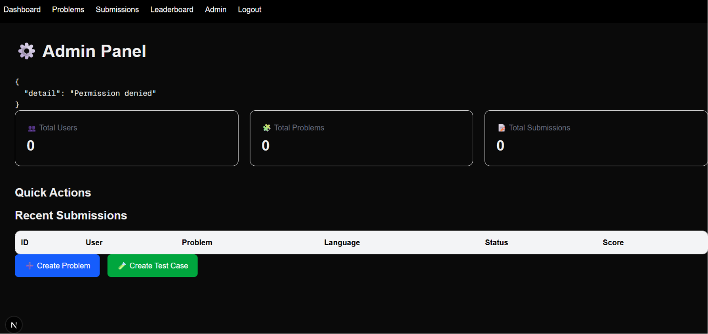

# AEOS - AI Engineering Operating System 🚀


## Overview

AEOS (AI Engineering Operating System) is an AI-powered coding assessment and internship hackathon platform developed by **TheGCPal Labs**.

The platform evaluates students using real engineering problems instead of traditional MCQ-based assessments.

Students can solve coding challenges inside an online editor, submit solutions, and receive automatic evaluation with scores and leaderboard ranking.

---

## Key Features

### Student Module

- User Registration
- JWT Authentication
- Secure Login
- Problem Browsing
- Online Code Editor
- Code Submission
- Automatic Test Case Evaluation
- Score Calculation
- Submission History
- Leaderboard Ranking

### Admin Module

- Admin Authentication
- Admin Dashboard
- User Management
- Create Coding Problems
- Add Test Cases
- Monitor Submissions
- View Platform Statistics

---

# Technology Stack

## Frontend

- Next.js 16
- TypeScript
- Tailwind CSS
- Monaco Code Editor

## Backend

- FastAPI
- Python 3.12
- SQLAlchemy ORM
- Alembic Migration

## Database

- PostgreSQL

## Infrastructure

- Docker
- Docker Compose
- Redis
- Linux Environment

---

# System Architecture

             Student / Admin
                   |
                   |
           Next.js Frontend
        TypeScript + Tailwind
                   |
                   |
            FastAPI Backend
                   |
    --------------------------------
    |              |               |
PostgreSQL Redis Code Executor
Database Cache Sandbox Runner
|
Users
Problems
Test Cases
Submissions
Scores

---

# Project Structure
AEOS/

├── frontend/
│ ├── app/
│ │ ├── dashboard/
│ │ ├── problems/
│ │ ├── submissions/
│ │ ├── leaderboard/
│ │ ├── admin/
│ │ └── register/
│ │
│ ├── components/
│ └── services/

├── backend/
│ ├── app/
│ │ ├── routers/
│ │ ├── models/
│ │ ├── services/
│ │ ├── executor/
│ │ └── database/

├── docker-compose.yml
├── docs/
├── screenshots/
└── README.md
---

# API Documentation

## Authentication

| Method | Endpoint | Description |
|---|---|---|
| POST | `/auth/register` | Register new user |
| POST | `/auth/login` | User login |
| GET | `/auth/me` | Current user details |

---

## Problems

| Method | Endpoint | Description |
|---|---|---|
| GET | `/problems/all` | Get all problems |
| GET | `/problems/{id}` | Get problem details |
| POST | `/problems/` | Create problem (Admin) |

---

## Test Cases

| Method | Endpoint | Description |
|---|---|---|
| POST | `/testcases/` | Add test case |
| GET | `/testcases/` | View test cases |

---

## Submissions

| Method | Endpoint | Description |
|---|---|---|
| POST | `/submissions/` | Submit solution |
| GET | `/submissions/my` | User submissions |

---

## Dashboard

| Method | Endpoint | Description |
|---|---|---|
| GET | `/dashboard` | Student dashboard |
| GET | `/admin/dashboard` | Admin statistics |

---

# Local Setup

## Clone Repository

```bash
git clone https://github.com/swapnilohol/AEOS.git

cd AEOS
Backend Setup
cd backend

python3 -m venv venv

source venv/bin/activate

pip install -r requirements.txt

uvicorn app.main:app --reload --host 0.0.0.0 --port 8000

Backend runs on:

http://localhost:8000

Health check:

http://localhost:8000/health
Frontend Setup
cd frontend

npm install

npm run dev

Frontend runs on:

http://localhost:3001
Demo Workflow
Student Flow
Register account
Login
Open coding problem
Write solution
Submit code
Automatic evaluation
Score generated
Leaderboard updated
Admin Flow
Admin login
Open admin dashboard
Create problem
Add test cases
Monitor submissions
Execution Engine

AEOS executes submitted code automatically.

Flow:

Submit Code
     |
     |
FastAPI Backend
     |
     |
Execution Engine
     |
     |
Test Cases Validation
     |
     |
Result + Score

Supported:

Python

Future:

Java
C++
JavaScript
Screenshots

Add screenshots inside:

screenshots/

Recommended screenshots:

Login Page
Registration Page
Student Dashboard
Problem Editor
Accepted Submission
Leaderboard
Admin Dashboard
Future Improvements
# Screenshots

## Register Page



## Login Page



## Student Dashboard



## Problems Page



## Code Editor



## Accepted Submission



## Leaderboard


# Screenshots

## Register Page


## Login Page


## Student Dashboard


## Problems Page


## Code Editor


## Accepted Submission


## Leaderboard


# Screenshots

## Register Page


## Login Page


## Student Dashboard


## Problems Page


## Code Editor


## Accepted Submission


## Leaderboard


## Admin Dashboard


## Admin Dashboard

Multi-language code execution
AI based code review
Cloud deployment
Advanced analytics
Anti-cheating system
Real-time monitoring
Project Information

Project Name: AEOS
AI Engineering Operating System

Pilot Institution:
Newton Institute of Science and Technology

Developer:
Swapnil Kashinath Ohol
